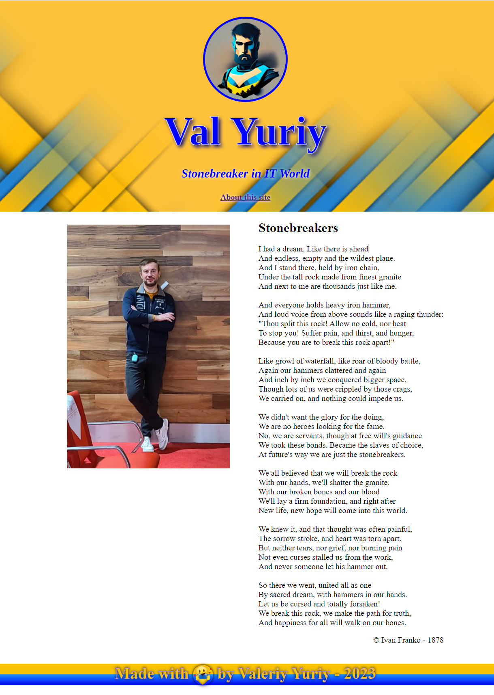
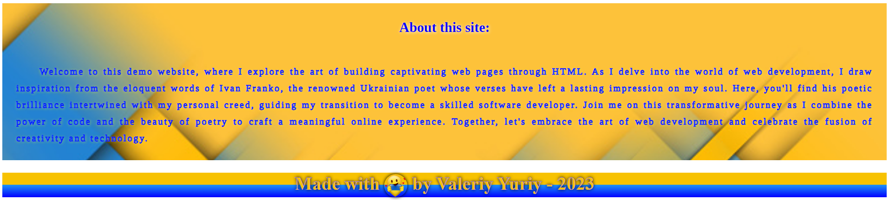

# mini-html

Welcome to this demo website, where I explore the art of building
captivating web pages through HTML. As I delve into the world of web
development, I draw inspiration from the eloquent words of Ivan Franko,
the renowned Ukrainian poet whose verses have left a lasting impression
on my soul. Here, you'll find his poetic brilliance intertwined with my
personal creed, guiding my transition to become a skilled software
developer. Join me on this transformative journey as I combine the power
of code and the beauty of poetry to craft a meaningful online
experience. Together, let's embrace the art of web development and
celebrate the fusion of creativity and technology.

## Main page - screenshot

## Second page - screenshot

